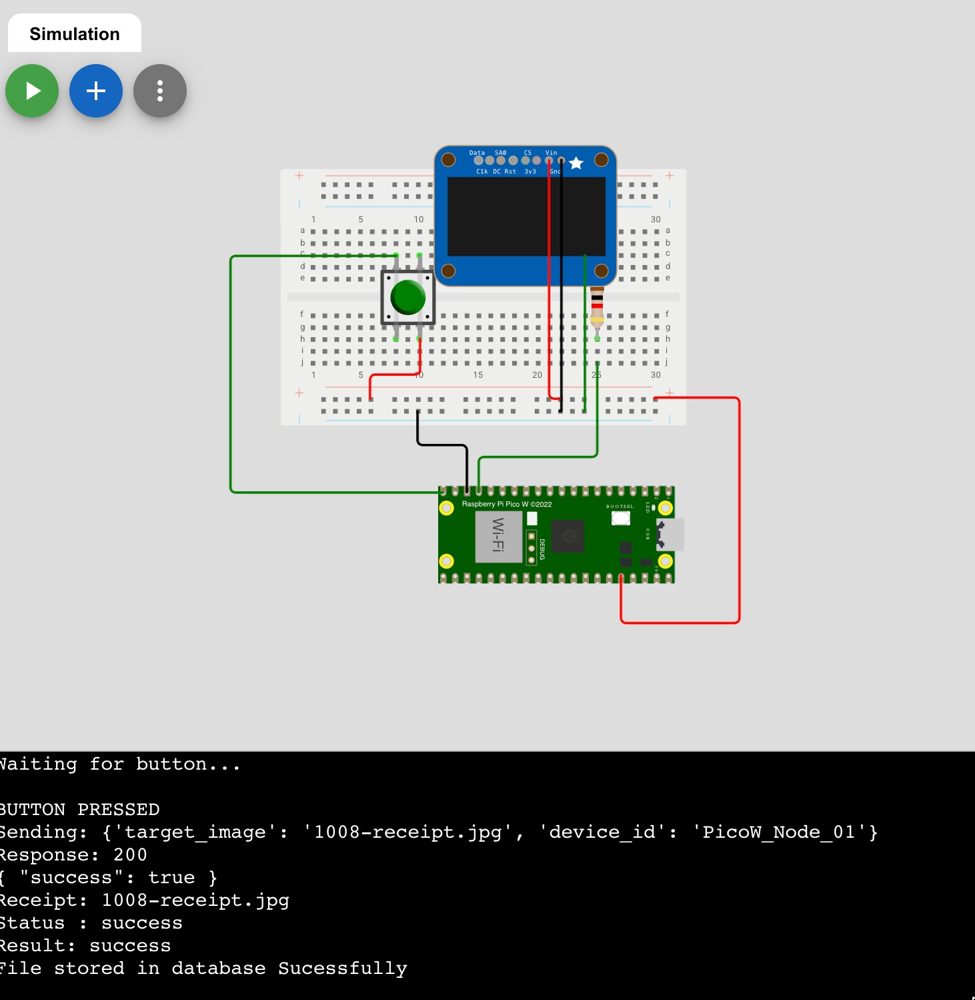
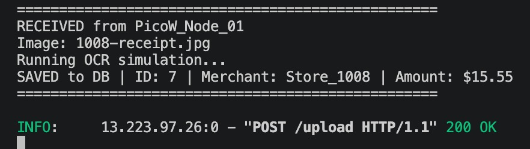
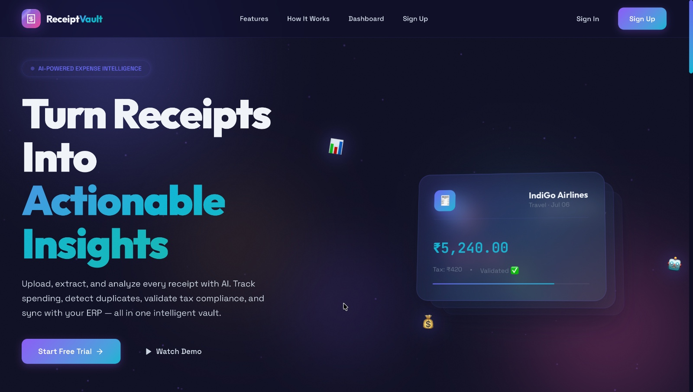
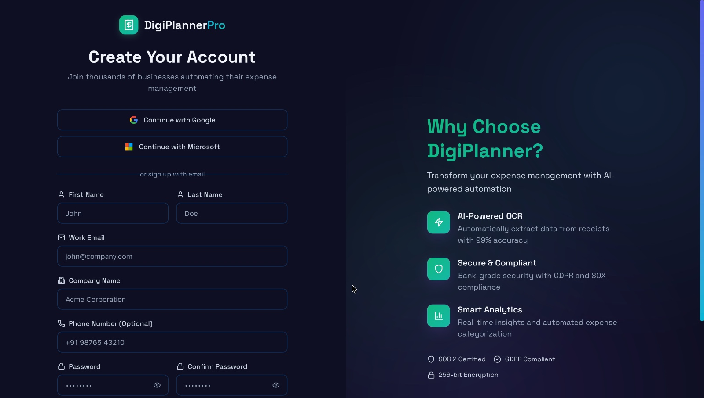
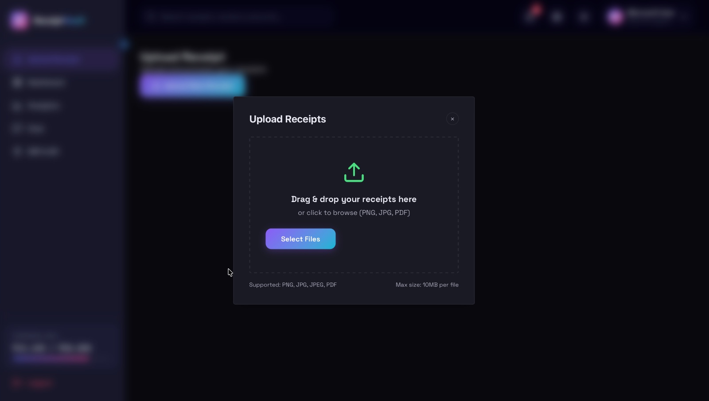
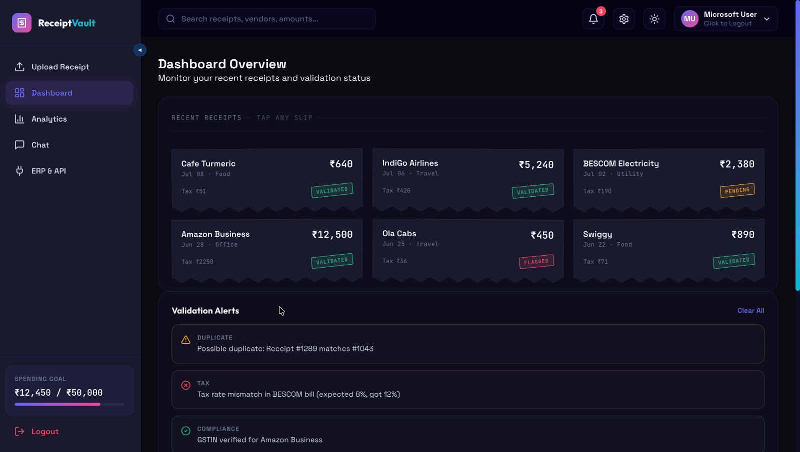
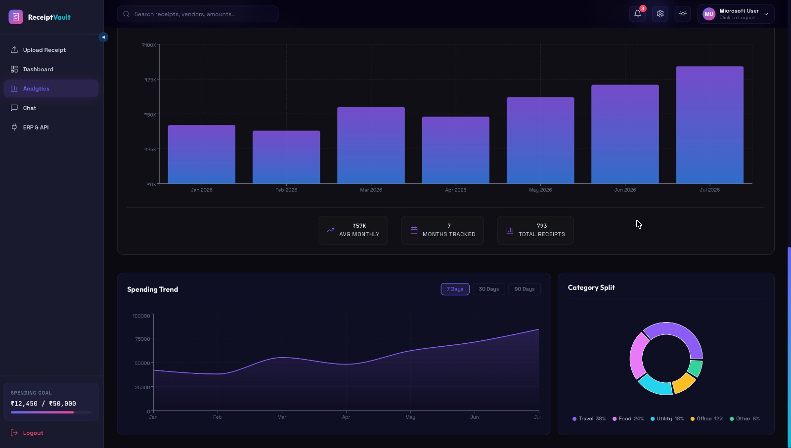
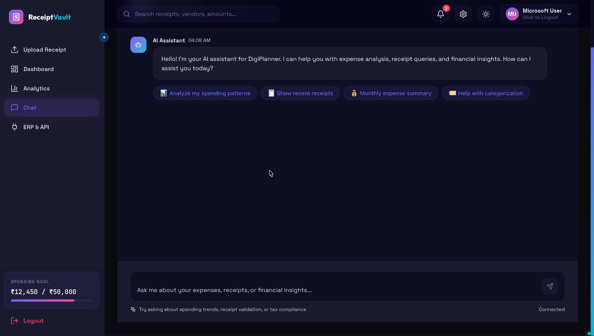
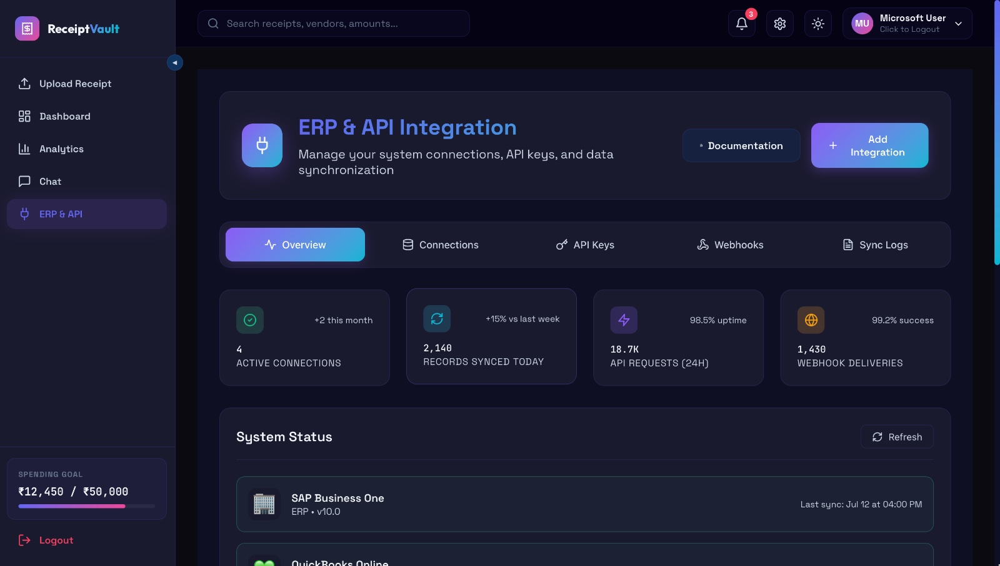

# Digi-planner


## 📋 Features

### 📸 Receipt & Invoice Processing
* Automated OCR-based text extraction from scanned receipts and invoices.
* Field-level parsing for date, vendor, amount, tax, and line items.
* Detect duplicates.
* Web-based dashboard for uploading files, reviewing extracted data, and downloading CSV/Excel reports.
* NLP/Regex-based extraction for date, vendor, invoice ID, tax, total amount, line items.

### 💰 Budget Tracking
* Set monthly spending limits
* Real-time budget monitoring
* Color-coded status indicators (On Track / Warning / Over Budget)
* Remaining budget calculations

### 📊 Analytics & Reporting
* Comprehensive spending analytics
* Expense categorization
* Generate detailed CSV/Excel reports
* Visual data insights and trends

### 🤖 AI-Powered Features
* Chat with your expense data
* Natural language queries
* Intelligent expense categorization
* Duplicate detection and prevention

### 🔐 Security & User Management
* User authentication (SignIn/SignUp)
* Secure data storage
* Session management
* User profile management

### 🎨 Modern UI/UX
* Beautiful gradient designs
* Smooth animations
* Responsive layout
* Professional styling
* User-friendly interface

### 🔌 Integration & APIs
* ERP integration capabilities
* RESTful API endpoints
* Data export options
* Third-party service integration

---

## 🚀 How to Run This Application

### Prerequisites
- Python 3.11 or higher
- pip (Python package manager)
- Git
- Virtual environment (recommended)

### Step 1: Clone the Repository
```bash
git clone https://github.com/Mayank2177/digiplanner.git
cd digiplanner
```

### Step 2: Create a Virtual Environment
```bash
# On Windows
python -m venv venv
venv\Scripts\activate

# On macOS/Linux
python3 -m venv venv
source venv/bin/activate
```

### Step 3: Install Dependencies
```bash
pip install -r requirements.txt
```

### Step 4: Configure Environment Variables
Create a `.env` file in the project root directory and add the following:
```
DATABASE_URL=your_database_url
SECRET_KEY=your_secret_key
DEBUG=True
FLASK_ENV=development
```

### Step 5: Initialize the Database
```bash
python manage.py db init
python manage.py db migrate
python manage.py db upgrade
```

### Step 6: Run the Application
```bash
# For development
python app.py

# Or using Flask CLI
flask run
```

The application will be available at `http://localhost:5000`

### Step 7: Access the Application
- Open your browser and navigate to `http://localhost:5000`
- Sign up for a new account or log in
- Start uploading receipts and invoices

### Optional: Run Tests
```bash
pytest
```

### Optional: Run with Docker
```bash
docker build -t digiplanner .
docker run -p 5000:5000 digiplanner
```

---

## 📸 Screenshots

### Results(1): Simulation Image


### Results(2): Server Result


### Results(3): Landing Page


### Results(4): SignIn/SignUp Page


### Results(5): Upload Receipt


### Results(6): Dashboard Page


### Results(7): Analytics Page


### Results(8): Chat with Data


### Results(9): ERP & API


---

## 📦 Project Structure
```
digiplanner/
├── app/
│   ├── templates/
│   ├── static/
│   ├── models/
│   └── routes/
├── config/
├── requirements.txt
├── .env
└── README.md
```

---

## 🤝 Contributing
Contributions are welcome! Please feel free to submit a Pull Request.

---

## 📄 License
This project is licensed under the MIT License - see the LICENSE file for details.

---

## 📧 Contact
For any inquiries, please contact: [Your Contact Information]
